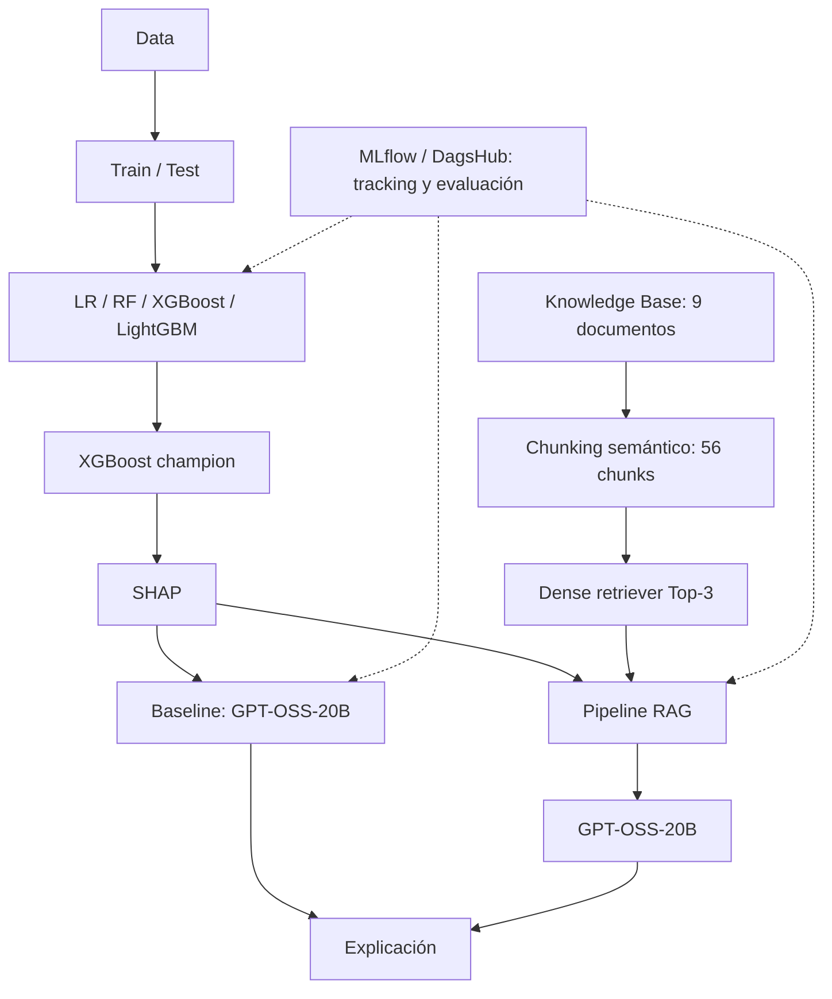

# Credit Risk ML — clasificación de incumplimiento

Proyecto reproducible de clasificación binaria de riesgo crediticio con
benchmark de cuatro modelos, explicabilidad SHAP, generación con GPT-OSS-20B,
RAG local y tracking en MLflow/DagsHub.

## Problema y datos

El target es `incumplimiento`: vale `1` si el cliente alcanza 30 o más días de
atraso (30+ DPD) dentro de los 12 meses posteriores a la originación y `0` si no
alcanza ese evento en esa ventana.

| Propiedad | Valor validado |
|---|---:|
| Filas | 41,976 |
| Features de modelado | 15 |
| Train | 33,580 (80%) |
| Test | 8,396 (20%) |
| Split | Aleatorio, estratificado, `random_state=42` |

La procedencia externa precisa, el muestreo y los criterios de inclusión no
están documentados. El diccionario completo está en
[`docs/knowledge_base/data_dictionary.md`](docs/knowledge_base/data_dictionary.md).

## Arquitectura



## Benchmark ML

Se evaluaron Logistic Regression, Random Forest, XGBoost y LightGBM. Cada
threshold se seleccionó maximizando Youden J sobre predicciones out-of-fold de
Train con cinco folds estratificados; Test quedó fuera de la selección del
threshold. Después se usó Test para comparar candidatos y elegir el champion,
por lo que no es un holdout externo posterior a esa selección.

| Modelo | Threshold | AUC | Gini | KS | Brier Score | Log Loss |
|---|---:|---:|---:|---:|---:|---:|
| Logistic Regression | 0.489574 | 0.684380 | 0.368760 | 0.280937 | 0.222377 | 0.635628 |
| Random Forest | 0.495716 | 0.700424 | 0.400848 | 0.296462 | 0.218887 | 0.626885 |
| **XGBoost** | **0.2399873** | **0.706305** | **0.412610** | **0.296907** | **0.158818** | **0.489626** |
| LightGBM | 0.217257 | 0.694485 | 0.388971 | 0.280056 | 0.161495 | 0.498995 |

XGBoost es el champion del score global que pondera por igual discriminación,
calibración y clasificación. Su global score es `0.916667`.

## Explainability y GenAI

SHAP describe cuánto contribuye cada feature al output del XGBoost para una
observación. Una contribución positiva eleva el output respecto de la referencia
y una negativa lo reduce. SHAP no demuestra causalidad y la explicación no
constituye una decisión ni una recomendación crediticia.

El provider GenAI es **Groq** y el modelo vigente es
`openai/gpt-oss-20b`. Se conservan dos variantes comparables:

- **Baseline:** XGBoost + SHAP + GPT-OSS-20B, sin retrieval.
- **RAG:** el mismo contexto predictivo/SHAP más conocimiento Top-3 y
  GPT-OSS-20B.

La capa GenAI explica una predicción ya calculada; no modifica probabilidad,
clase, threshold ni banda.

## RAG V1

```text
Knowledge Base (9 documentos)
  → chunking semántico determinista (56 chunks)
  → local-lsa-tfidf-svd-v1
  → dense retrieval Top-3
  → GPT-OSS-20B
  → explicación grounded
```

| Métrica de retrieval | Resultado |
|---|---:|
| Hit Rate@3 | 0.750000 |
| MRR@3 | 0.597222 |
| Hits | 18/24 |

El retriever es un baseline denso local y reproducible. Su Hit Rate@3 muestra
que recuperar evidencia correcta sigue siendo una limitación y una oportunidad
de mejora; este proyecto no implementa búsqueda híbrida ni reranking.

## Evaluación Baseline vs RAG

Los dos sistemas se evaluaron sobre los mismos 24 casos con el mismo modelo,
contexto predictivo y reglas determinísticas.

| Métrica | Baseline | RAG | Delta |
|---|---:|---:|---:|
| Factual correctness | 0.312500 | 0.619444 | +0.306944 |
| Groundedness | 0.731483 | 0.636900 | -0.094584 |
| Answer relevance | 0.214051 | 0.510171 | +0.296120 |
| Abstention accuracy | 0.458333 | 0.958333 | +0.500000 |
| Integrated prediction consistency | 0.750000 | 0.821429 | +0.071429 |

Resultado por caso: **19 mejorados, 5 empatados y 0 empeorados**. Esto no
demuestra superioridad universal. El scorer de groundedness considera grounded
una abstención sin afirmaciones, aunque sea poco útil; debe interpretarse junto
con factual correctness y answer relevance.

### Costo operativo observado

| Variante | Latencia promedio | Tokens totales |
|---|---:|---:|
| Baseline | 0.800526 s | 18,352 |
| RAG | 0.949150 s | 33,212 |

RAG mejoró principalmente factualidad, relevancia y abstención, a cambio de
aproximadamente `+0.15 s` y `+80.97%` de tokens en esta evaluación.

## MLflow y DagsHub

El proyecto mantiene dos experimentos separados:

- `credit-risk-model-benchmark`: cuatro candidatos ML y champion.
- `credit-risk-rag-evaluation`: runs `baseline_gpt_oss_20b` y
  `rag_gpt_oss_20b`.

Los runs GenAI y sus artifacts están validados en el
[experimento público de DagsHub](https://dagshub.com/elverl/credit-risk-ml.mlflow/#/experiments/1).
Las credenciales no se almacenan en el repositorio ni en los manifests.

## Reproducibilidad

Requiere Python 3.12 y [`uv`](https://docs.astral.sh/uv/). Desde la raíz:

```bash
uv sync
uv run python scripts/preprocess.py
uv run python scripts/train.py
uv run python scripts/build_rag_chunks.py
uv run python scripts/evaluate_rag_retrieval.py
uv run python scripts/run_rag_evalset.py
uv run python scripts/evaluate_rag_baseline_comparison.py
uv run pytest -q
```

Las llamadas remotas requieren que la credencial correspondiente ya esté
configurada de forma segura en el entorno.

## Estructura

```text
credit-risk-ml/
├── data/                       # raw y split procesado
├── notebooks/                  # preprocessing y análisis ML
├── src/credit_risk/
│   └── rag/                    # chunking, retriever, pipeline y evaluación
├── scripts/                    # entry points reproducibles
├── docs/
│   ├── knowledge_base/         # 9 documentos vigentes
│   └── model_card.md
├── evaluation/                 # golden evalset de 24 casos
├── artifacts/
│   ├── models/                 # modelos persistidos
│   ├── metrics/                # benchmark, thresholds y SHAP
│   ├── figures/                # visualizaciones
│   └── rag/                    # chunks, evaluaciones, respuestas y manifests
├── tests/
├── pyproject.toml
└── uv.lock
```

La estrategia documentada usa Pull Requests `feature/* → development → main`.
En esta fase no se realizan operaciones Git ni se publica una release.

## Conclusiones y limitaciones

- XGBoost es el champion offline y usa threshold `0.2399873` seleccionado con
  Train OOF.
- RAG mejora varias métricas del evalset, pero aumenta costo y depende de un
  retriever con Hit Rate@3 de 0.75.
- Test participó en la selección del champion; no existe holdout externo
  posterior, validación temporal ni evidencia productiva.
- No se evaluaron sistemáticamente fairness, cumplimiento regulatorio,
  estabilidad poblacional o desempeño online.
- El repositorio no contiene políticas institucionales de aprobación, pricing,
  excepciones o límites de crédito.

Consulta la [Model Card](docs/model_card.md) para el alcance y las limitaciones
detalladas.
